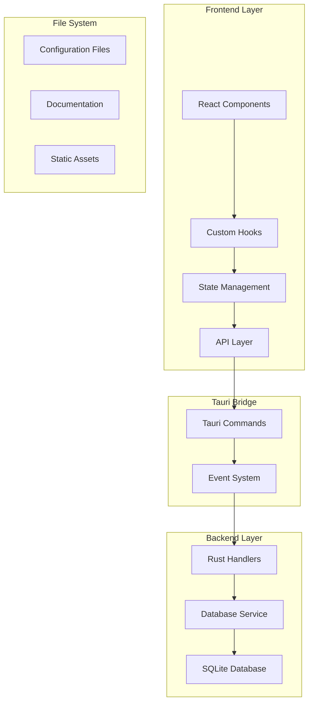

# Design Document

## Overview

This design document outlines the architecture and implementation approach for a personal task and event tracking desktop application built with Tauri, React, and TypeScript. The application will provide a native desktop experience with modern web technologies, featuring local data persistence through SQLite and a clean, responsive UI built with Tailwind CSS.

The design follows a layered architecture pattern with clear separation between the frontend (React/TypeScript), backend (Tauri/Rust), and data layer (SQLite). This approach ensures maintainability, testability, and scalability for future feature additions.

## Architecture

### High-Level Architecture



### Technology Stack

- **Frontend**: React 19+ with TypeScript, Vite for bundling
- **Styling**: Tailwind CSS for utility-first styling
- **Desktop Framework**: Tauri 2.x for native desktop capabilities
- **Backend**: Rust with Tauri's command system
- **Database**: SQLite for local data persistence
- **Package Manager**: pnpm for efficient dependency management
- **Development Tools**: ESLint, Prettier, TypeScript compiler

## Components and Interfaces

### Frontend Components Structure

```
src/
├── components/
│   ├── common/           # Reusable UI components
│   │   ├── Button.tsx
│   │   ├── Input.tsx
│   │   └── Modal.tsx
│   ├── layout/           # Layout components
│   │   ├── Header.tsx
│   │   ├── Sidebar.tsx
│   │   └── MainLayout.tsx
│   └── features/         # Feature-specific components
│       ├── tasks/
│       └── events/
├── hooks/                # Custom React hooks
│   ├── useDatabase.ts
│   ├── useTasks.ts
│   └── useEvents.ts
├── types/                # TypeScript type definitions
│   ├── database.ts
│   ├── tasks.ts
│   └── events.ts
├── utils/                # Utility functions
│   ├── dateHelpers.ts
│   └── validation.ts
├── services/             # API and service layer
│   ├── tauriApi.ts
│   └── database.ts
└── App.tsx               # Main application component
```

### Tauri Command Interface

```typescript
// Frontend API interface
interface TauriAPI {
  // Database operations
  initializeDatabase(): Promise<void>;
  
  // Task operations
  createTask(task: CreateTaskRequest): Promise<Task>;
  getTasks(filters?: TaskFilters): Promise<Task[]>;
  updateTask(id: string, updates: UpdateTaskRequest): Promise<Task>;
  deleteTask(id: string): Promise<void>;
  
  // Event operations
  createEvent(event: CreateEventRequest): Promise<Event>;
  getEvents(filters?: EventFilters): Promise<Event[]>;
  updateEvent(id: string, updates: UpdateEventRequest): Promise<Event>;
  deleteEvent(id: string): Promise<void>;
}
```

### Rust Backend Structure

```
src-tauri/
├── src/
│   ├── main.rs           # Application entry point
│   ├── commands/         # Tauri command handlers
│   │   ├── mod.rs
│   │   ├── database.rs
│   │   ├── tasks.rs
│   │   └── events.rs
│   ├── models/           # Data models
│   │   ├── mod.rs
│   │   ├── task.rs
│   │   └── event.rs
│   ├── database/         # Database layer
│   │   ├── mod.rs
│   │   ├── connection.rs
│   │   └── migrations.rs
│   └── utils/            # Utility functions
│       └── mod.rs
├── tauri.conf.json       # Tauri configuration
└── Cargo.toml            # Rust dependencies
```

## Data Models

### Task Model

```typescript
interface Task {
  id: string;
  title: string;
  description?: string;
  completed: boolean;
  priority: 'low' | 'medium' | 'high';
  dueDate?: Date;
  createdAt: Date;
  updatedAt: Date;
  tags: string[];
}

interface CreateTaskRequest {
  title: string;
  description?: string;
  priority?: 'low' | 'medium' | 'high';
  dueDate?: Date;
  tags?: string[];
}

interface UpdateTaskRequest {
  title?: string;
  description?: string;
  completed?: boolean;
  priority?: 'low' | 'medium' | 'high';
  dueDate?: Date;
  tags?: string[];
}
```

### Event Model

```typescript
interface Event {
  id: string;
  title: string;
  description?: string;
  startDate: Date;
  endDate?: Date;
  isRecurring: boolean;
  recurrencePattern?: RecurrencePattern;
  createdAt: Date;
  updatedAt: Date;
}

interface RecurrencePattern {
  type: 'daily' | 'weekly' | 'monthly' | 'yearly';
  interval: number;
  endDate?: Date;
  daysOfWeek?: number[]; // For weekly recurrence
  dayOfMonth?: number;   // For monthly recurrence
}
```

### Database Schema

```sql
-- Tasks table
CREATE TABLE tasks (
    id TEXT PRIMARY KEY,
    title TEXT NOT NULL,
    description TEXT,
    completed BOOLEAN DEFAULT FALSE,
    priority TEXT DEFAULT 'medium',
    due_date DATETIME,
    created_at DATETIME DEFAULT CURRENT_TIMESTAMP,
    updated_at DATETIME DEFAULT CURRENT_TIMESTAMP
);

-- Events table
CREATE TABLE events (
    id TEXT PRIMARY KEY,
    title TEXT NOT NULL,
    description TEXT,
    start_date DATETIME NOT NULL,
    end_date DATETIME,
    is_recurring BOOLEAN DEFAULT FALSE,
    recurrence_pattern TEXT, -- JSON string
    created_at DATETIME DEFAULT CURRENT_TIMESTAMP,
    updated_at DATETIME DEFAULT CURRENT_TIMESTAMP
);

-- Task tags (many-to-many relationship)
CREATE TABLE task_tags (
    task_id TEXT,
    tag TEXT,
    PRIMARY KEY (task_id, tag),
    FOREIGN KEY (task_id) REFERENCES tasks(id) ON DELETE CASCADE
);
```

## Error Handling

### Frontend Error Handling

```typescript
// Error types
interface AppError {
  code: string;
  message: string;
  details?: any;
}

// Error handling hook
const useErrorHandler = () => {
  const [error, setError] = useState<AppError | null>(null);
  
  const handleError = (error: AppError) => {
    setError(error);
    // Log error, show notification, etc.
  };
  
  const clearError = () => setError(null);
  
  return { error, handleError, clearError };
};
```

### Backend Error Handling

```rust
// Custom error types
#[derive(Debug, thiserror::Error)]
pub enum AppError {
    #[error("Database error: {0}")]
    Database(#[from] rusqlite::Error),
    
    #[error("Validation error: {0}")]
    Validation(String),
    
    #[error("Not found: {0}")]
    NotFound(String),
    
    #[error("Internal error: {0}")]
    Internal(String),
}

// Error conversion for Tauri
impl From<AppError> for tauri::Error {
    fn from(err: AppError) -> Self {
        tauri::Error::Anyhow(err.into())
    }
}
```

## Testing Strategy

### Frontend Testing

1. **Unit Tests**: Test individual components and hooks using Jest and React Testing Library
2. **Integration Tests**: Test component interactions and API calls
3. **E2E Tests**: Test complete user workflows using Playwright or similar

```typescript
// Example component test
describe('TaskList Component', () => {
  it('should render tasks correctly', () => {
    const tasks = [
      { id: '1', title: 'Test Task', completed: false }
    ];
    
    render(<TaskList tasks={tasks} />);
    
    expect(screen.getByText('Test Task')).toBeInTheDocument();
  });
});
```

### Backend Testing

1. **Unit Tests**: Test individual Rust functions and modules
2. **Integration Tests**: Test Tauri commands and database operations
3. **Database Tests**: Test database operations with in-memory SQLite

```rust
#[cfg(test)]
mod tests {
    use super::*;
    
    #[tokio::test]
    async fn test_create_task() {
        let db = setup_test_db().await;
        let task = CreateTaskRequest {
            title: "Test Task".to_string(),
            description: None,
            priority: Some("medium".to_string()),
            due_date: None,
            tags: vec![],
        };
        
        let result = create_task(&db, task).await;
        assert!(result.is_ok());
    }
}
```

### Build and Development Configuration

#### Package.json Scripts

```json
{
  "scripts": {
    "dev": "tauri dev",
    "build": "tauri build",
    "test": "jest",
    "test:watch": "jest --watch",
    "lint": "eslint src --ext .ts,.tsx",
    "format": "prettier --write src/**/*.{ts,tsx}",
    "type-check": "tsc --noEmit"
  }
}
```

#### Tauri Configuration

Key configuration points for `tauri.conf.json`:
- Window properties (size, title, icon)
- Security settings and CSP
- Database plugin configuration
- Build settings for different platforms
- Development server configuration

#### Development Workflow

1. **Setup**: Initialize project with Tauri CLI and configure dependencies
2. **Development**: Use `pnpm dev` for hot-reload development
3. **Testing**: Run tests with `pnpm test` before commits
4. **Building**: Use `pnpm build` for production builds
5. **Documentation**: Maintain docs in the `docs/` folder

This design provides a solid foundation for the personal task tracker application, with clear separation of concerns, robust error handling, and comprehensive testing strategies.